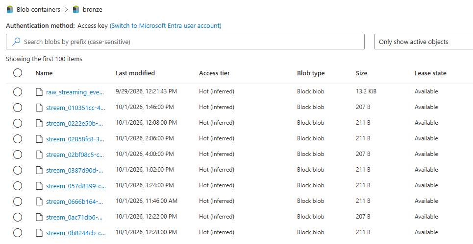
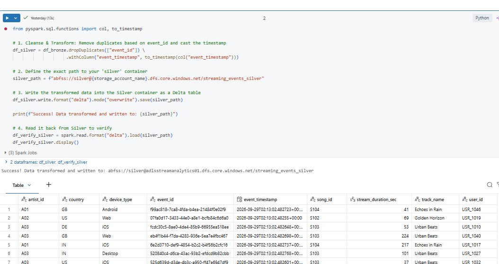
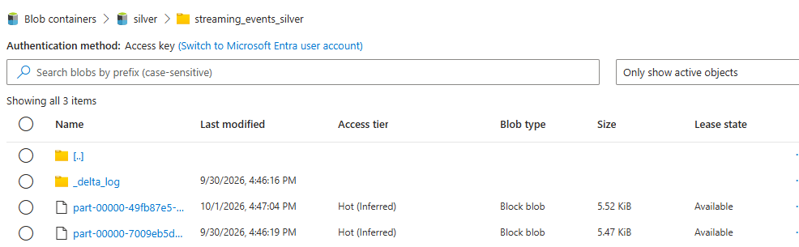
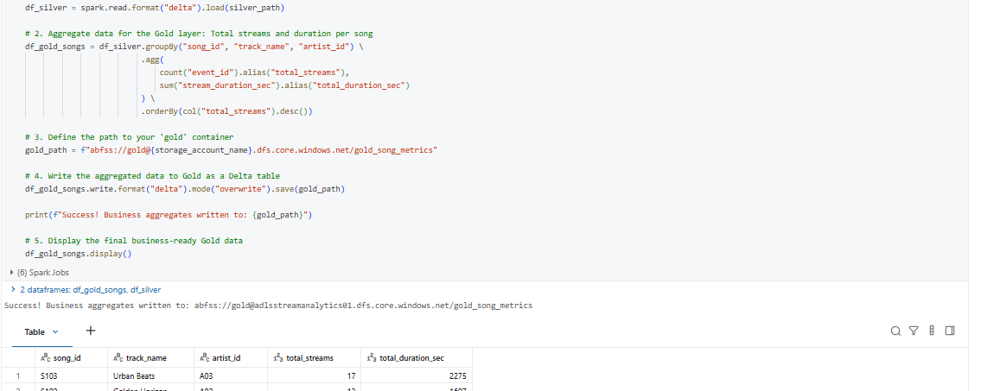
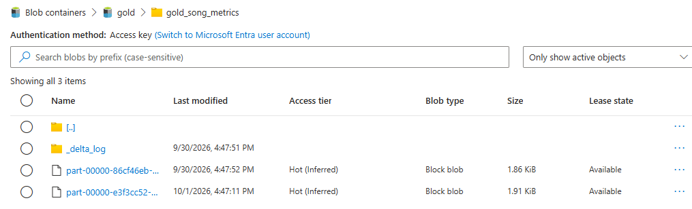
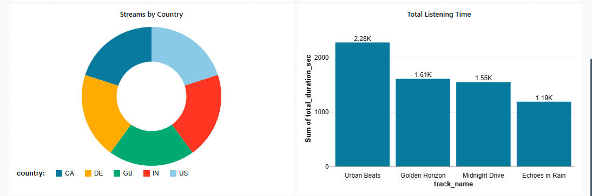
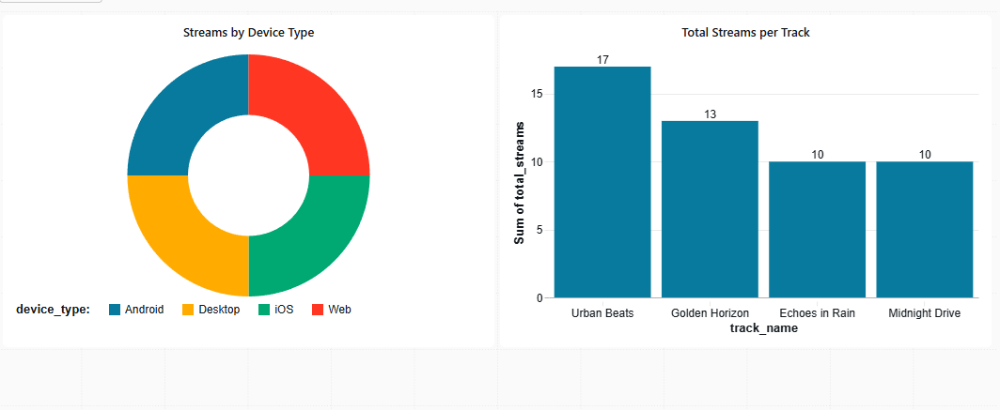

# Azure Real-Time Music Streaming Analytics Pipeline

This project demonstrates an end-to-end data engineering pipeline simulating a real-time music streaming platform (like Spotify). Raw event data is generated via Python, ingested through serverless compute, orchestrated, transformed using the Medallion Architecture (Bronze, Silver, Gold), and served for Business Intelligence.

**Tech Stack:** Python, Azure Functions, Azure Data Factory (ADF), Azure Data Lake Storage Gen2 (ADLS), Databricks, PySpark, Delta Lake.

## Architecture & Data Flow

1. **Ingestion (Serverless):** An Azure Function App executes a Python script to generate mock JSON streaming events (Event ID, Device, Country, Track) and continuously uploads them to the Bronze layer.
2. **Storage (Data Lake):** ADLS Gen2 houses the data across Bronze (raw JSON), Silver (cleansed Delta tables), and Gold (aggregated Delta tables) containers.
3. **Orchestration:** Azure Data Factory schedules and triggers the data movement and Databricks transformation notebooks.
4. **Transformation (Databricks/PySpark):** 
    * *Bronze to Silver:* Cleanses data, drops duplicates, casts timestamps, and enforces schema using Delta Lake.
    * *Silver to Gold:* Aggregates business-level metrics (total streams and listening time per track).
5. **Serving (BI):** Databricks SQL Dashboards connect directly to the Gold/Silver tables to visualize user demographics and track performance.

## 1. Cloud Infrastructure
The foundational Azure resources provisioning the end-to-end cloud environment.

## 2. Serverless Data Ingestion (Bronze Layer)
The Azure Function App handles event-driven ingestion, reliably pushing mock JSON streaming data into the ADLS Bronze container.

## 3. Automated Orchestration
Azure Data Factory manages the pipeline schedule, triggering the Medallion architecture Databricks notebooks.

## 4. PySpark Data Transformation (Silver & Gold Layers)
Data is cleaned, filtered, and aggregated using PySpark, then written back to ADLS in the ACID-compliant Delta format.

**Bronze to Silver Transformation:**

**Silver to Gold Transformation:**

## 5. Business Intelligence Dashboard
Cleaned and aggregated data is served directly to end-users via Databricks SQL Dashboards to analyze platform trends, device usage, and track popularity.

## Repository Structure

* `src/data_ingestion/`: Python scripts and Azure Function code for generating and ingesting simulated API events.
* `src/data_transformation/`: Databricks PySpark notebooks (`.ipynb`) for Medallion architecture data transformations.
* `sample_data/`: Sample raw JSON event data (`raw_streaming_events.json`).
* `Outputs/`: Visual documentation and pipeline execution proofs.

## Key Learnings
* Managed schema evolution and schema merging within Delta Lake.
* Configured secure, automated integration between Azure Data Factory and Databricks using Linked Services.
* Implemented event-driven serverless ingestion to minimize compute costs.
